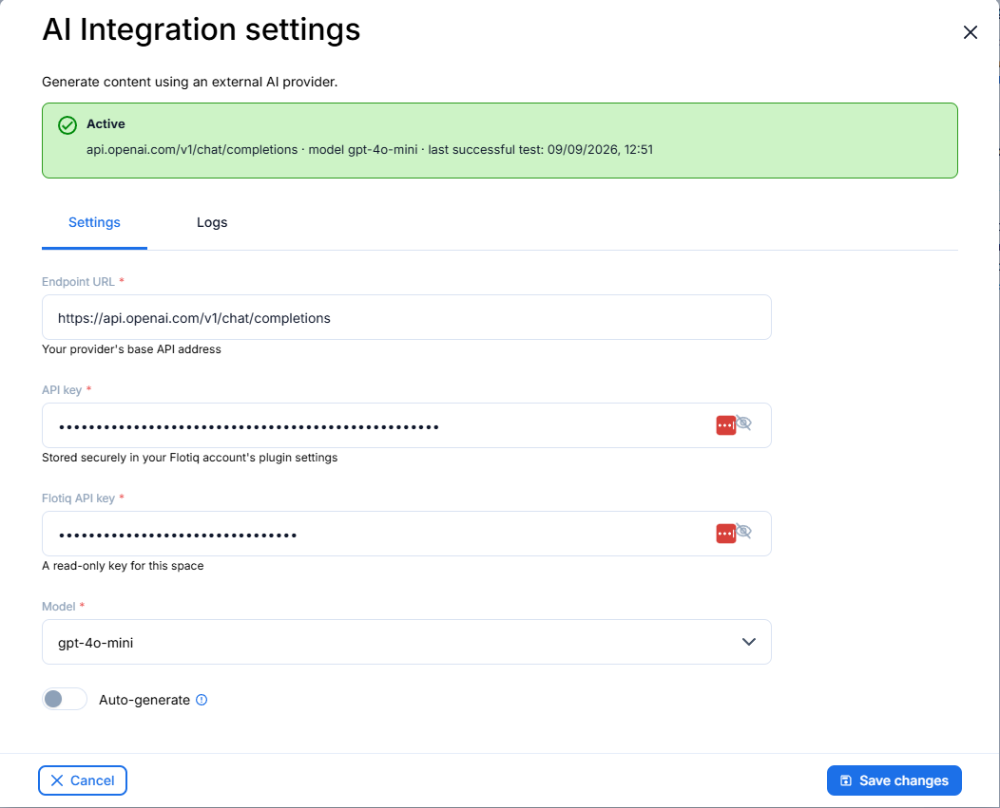
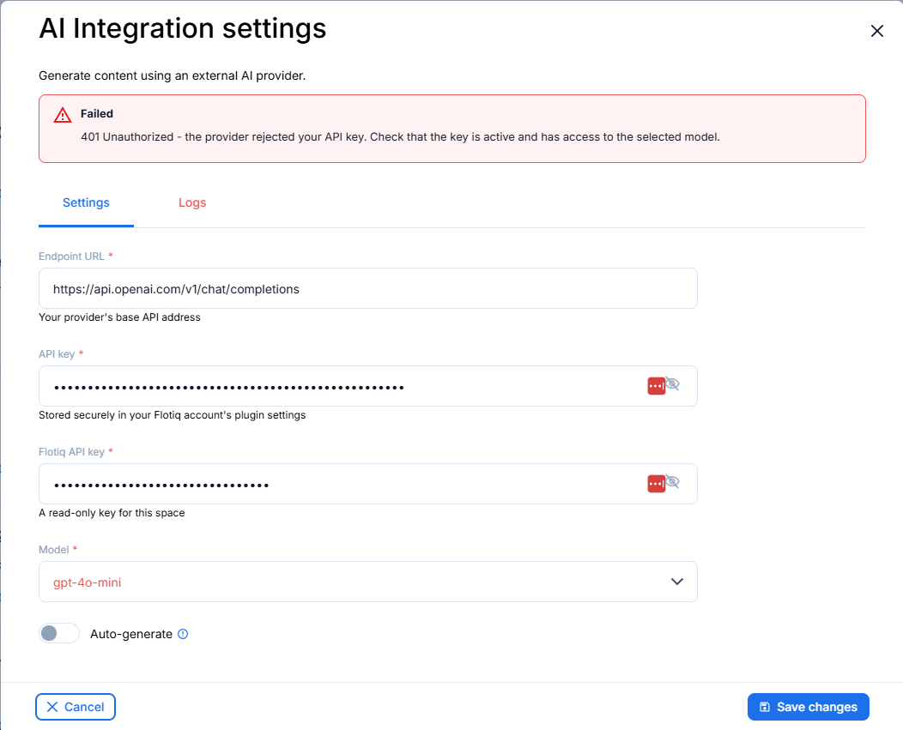
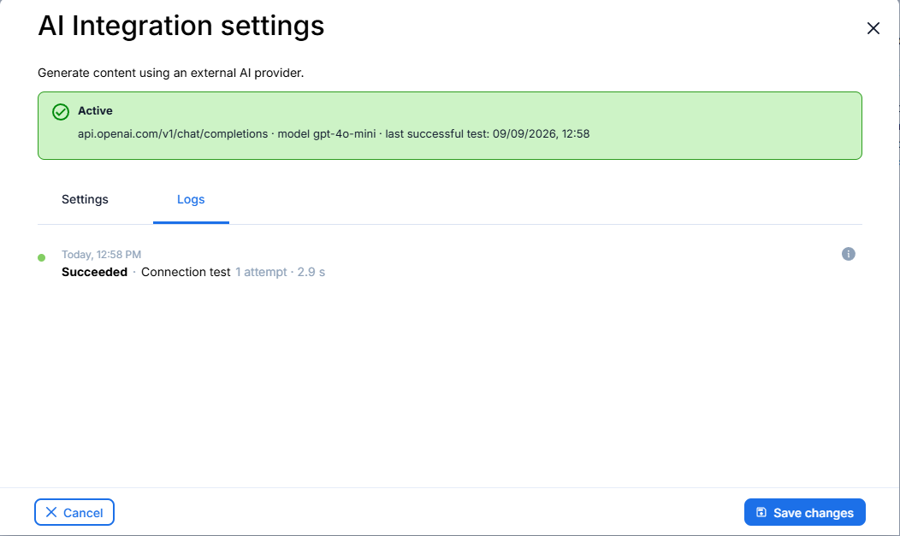

<a href="https://flotiq.com/">
  
</a>

# AI Integration Plugin

## Overview

AI Integration Plugin connects a Flotiq space to an external AI provider. Flotiq does not ship its own model - you bring
your own endpoint and key, and the plugin stores that configuration per space.

The plugin works with any OpenAI-compatible chat completions API, including OpenAI, Azure OpenAI, Ollama, LM Studio and
OpenRouter. Requests to the provider are made by a Cloudflare
Worker, not by the browser, so the provider key never has to be exposed to page scripts at generation time.

Settings cannot be saved until a connection test passes, so a space never ends up holding a configuration nobody has
verified.

## Configuration

Open the plugin settings from the plugin list and fill in four fields.

| Field          | Description                                                                                                                                                            |
|----------------|------------------------------------------------------------------------------------------------------------------------------------------------------------------------|
| Endpoint URL   | The **full** chat completions endpoint, for example `https://api.openai.com/v1/chat/completions`. The address is used exactly as entered - nothing is appended to it.  |
| API key        | Key for your AI provider.                                                                                                                                              |
| Flotiq API key | A read-only key for this space. It proves to the integration service that you have access to the space; the service uses its own credentials for everything it writes. |
| Model          | Populated automatically once the endpoint URL and API key are filled in - see below.                                                                                   |
| Auto-generate  | When enabled, empty fields are filled in by AI on save, as a draft for review.                                                                                         |



### Model list

After you leave the API key field, the plugin fetches the provider's model listing and fills the select dropdown. The
listing URL is derived from the endpoint by dropping the trailing operation segment, so
`https://api.openai.com/v1/chat/completions` becomes `https://api.openai.com/v1/models`.

Providers that expose no listing - Cloudflare Workers AI encodes the model in the URL path, Azure OpenAI uses a
different scheme - leave the select empty. The request goes from the browser straight to the provider, so the provider
must also allow cross-origin requests.

## Connection test

Saving runs one test request against a built-in test image and handles three outcomes:

- **Success** - settings are saved.
- **Warning** - the model answered but returned no usable title or alt text. The attempt is recorded in the log and the
  settings are still saved.
- **Blocking error** - settings are not saved. The banner explains what failed and a hint is pinned to the field at
  fault: the endpoint, one of the two keys, or the model.

The test performs no retries, so a temporarily unavailable model surfaces here as a blocking error.



## Logs

The **Logs** tab lists the connection tests run for this space, newest first: the outcome, the number of attempts, how
long the request took, and the message behind the info icon.

The history belongs to the worker, not to the plugin. The worker writes every `/test` run to the `ai_logs` content
type and tags it with `job_id` set to `test`, which is what separates connection tests from generation jobs. The tab
reads them back with `GET /logs/{space-id}?job_id=test` - once when the settings modal opens, and again after every
test, because the plugin never sees the entry the worker just wrote.



## Development

### Quick start

1. `yarn` - install dependencies
2. `yarn start` - development mode, rebuilds on file changes and serves the plugin over HTTPS
3. `yarn build` - production build

### Output

The plugin is built into a single `dist/index.js` file. The manifest is copied to `dist/plugin-manifest.json`.

### Local certificate

`yarn start` serves over HTTPS from `.dev/localhost.cert` and `.dev/localhost.key`, because the Flotiq editor is served
over HTTPS and will not load a plugin over plain HTTP. Make sure your browser trusts that certificate - open
`https://localhost:3053/index.js` once and accept it.

### Worker URL

The address of the integration service is baked in at build time. It defaults to production and is overridden from
`.env`:

```
WORKER_URL=http://localhost:8788
```

Only `yarn start` reads this file. `yarn build` deliberately ignores it and always bakes in the production
address, so a release never ships a bundle pointing at whoever happened to run the build.

To point a one-off production build somewhere else, pass the variable explicitly:

```bash
npx cross-env WORKER_URL=http://localhost:8788 node esbuild.config.js
```

### Running the worker locally

In the flotiq-image-ai-worker repository:

```bash
wrangler dev --env=dev --port 8788 \
  --var FLOTIQ_API_URL:http://localhost:8069 \
  --var TEST_IMAGE_ID:<id of a PNG that exists in your instance>
```

- `--env=dev` is required - without it the worker has no vars, KV namespace or queues.
- Port `8788` avoids a clash with the `flotiq-worker` container from `flotiq-backend`, which already publishes `8787`.
- `FLOTIQ_API_URL` must point at the same Flotiq instance your editor is talking to. It is used both to validate the
  Flotiq API key and to download the test image, so the two cannot be split.
- `TEST_IMAGE_ID` must name a **PNG** that exists in that instance - the worker builds the URL as `image/0x0/<id>.png`
  with the extension hardcoded.

### Test values

| Field          | Value                                            |
|----------------|--------------------------------------------------|
| Endpoint URL   | `https://api.openai.com/v1/chat/completions`     |
| API key        | your own provider key                            |
| Flotiq API key | a read-only key for the space you are testing in |
| Model          | `gpt-4o-mini`                                    |

**Do not use `https://api.openai.com/v1` alone.** A bare base URL returns `404` with an empty body and no CORS headers,
which the browser reports as a CORS failure rather than a wrong address.

### Loading the plugin

#### URL

**Hint**: you can use the localhost URL from development mode - `https://localhost:3053/index.js`

1. Open the Flotiq editor
2. Open the browser dev console
3. Execute:
   ```javascript
   FlotiqPlugins.loadPlugin('flotiq.ai-integration', 'https://localhost:3053/index.js')
   ```
4. Navigate to the view modified by the plugin

The id must match the `id` field in `plugin-manifest.json`. The plugin reads its saved settings by the manifest id, so a
different id here leaves the settings form empty.

#### Manifest

**Hint**: you can use the localhost URL from development mode - `https://localhost:3053/plugin-manifest.json`

1. Open the Flotiq editor
2. Add a new plugin and paste the URL of the hosted `plugin-manifest.json`
3. Navigate to the view modified by the plugin

**Warning:** while developing, make sure your browser trusts the local certificate on
`https://localhost:3053/plugin-manifest.json`, so it can be used with `https://editor.flotiq.com`.

### Dev environment

Dev environment is configured to use:

* `prettier` - best used with automatic format on save in IDE
* `esbuild` - bundles the plugin and inlines the stylesheet

## Collaborating

If you wish to talk with us about this project, feel free to hop on
our [](https://discord.gg/FwXcHnX).

If you found a bug, please report it in [issues](https://github.com/flotiq/flotiq-ui-plugin-templates-plain-js/issues).
